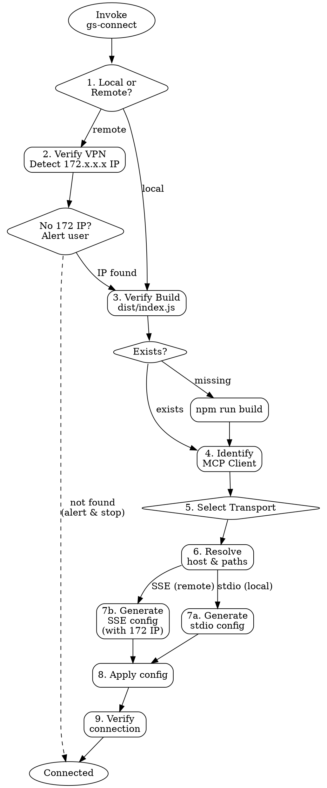

# GS Connect

<HARD-GATE>
Do NOT generate connection configuration until ALL of the following are confirmed:
1. Network access verified (VPN active, server internal IP detected)
2. Server build status verified (mcp-server/dist/index.js exists)
3. User's MCP client identified
4. Transport method selected (stdio or SSE)
Producing a config snippet before completing steps 1-4 violates this gate.
</HARD-GATE>

## Checklist

Complete every step in order. Do not skip, reorder, or abbreviate.

1. **Determine connection type** — Is the user connecting locally (on this machine) or remotely (from another machine)?
   - **Local** → skip to step 3 (no VPN needed)
   - **Remote** → continue to step 2

2. **Verify network access** — Remote users must be on the internal network via CloudFlare VPN.
   - Instruct user: "CloudFlare VPN을 켜세요."
   - Instruct user: "1Password에서 **Yongyong Machine**을 검색하세요. **웹사이트** 필드의 IP 주소(172.x.x.x 부분)가 MCP 서버 주소입니다."
   - User가 IP를 알려주면 그 값을 SSE config의 host로 사용한다.

3. **Verify build** — Check that `mcp-server/dist/index.js` exists. If missing, run `cd mcp-server && npm run build`. Do not proceed until the build artifact exists.

4. **Identify MCP client** — Ask the user which client they use:
   - Claude Desktop
   - Claude Code (CLI / VS Code / JetBrains)
   - Cursor
   - Windsurf
   - Other (SSE-compatible)

5. **Select transport** — Determine the appropriate transport:
   - **stdio** — Local connections only (Claude Desktop, Claude Code, Cursor on this machine)
   - **SSE/HTTP** — Remote connections (always), multi-session, web clients, PM2-managed server

6. **Resolve host and paths** —
   - **Local (stdio):** Compute absolute path to workspace root (`GS_OS_BASE_PATH`). This is the directory containing `mcp-server/`, `output/`, `games/`, `client/`.
   - **Remote (SSE):** Use the IP the user provided from 1Password (step 2) as the host.

7. **Generate config** — Produce the client-specific configuration using the templates below. Replace all placeholders with actual values from steps 2 and 6.

8. **Apply config** — Guide the user to place the configuration in the correct location for their client.

9. **Verify connection** —
   - stdio: restart the client and check that gs-os-ontology tools appear (16 tools expected)
   - SSE: `curl http://<INTERNAL_IP>:3100/health` should return `{"status":"ok",...}`

## Server Reference

| Property | Value |
|----------|-------|
| Server name | `gs-os-ontology` |
| Entry point | `mcp-server/dist/index.js` |
| Build command | `cd mcp-server && npm run build` |
| PM2 config | `ecosystem.config.js` (runs `npm start` in mcp-server/) |
| Default port | 3100 |

### Network

| Item | Detail |
|------|--------|
| VPN | CloudFlare (required for remote access) |
| Server IP | 1Password → **Yongyong Machine** 검색 → **웹사이트** 필드의 IP (172.x.x.x) |
| Firewall | Port 3100 open (no additional config needed) |

### Transports

| Transport | Flag | Port | Endpoints |
|-----------|------|------|-----------|
| stdio | (none) | N/A | stdin/stdout |
| SSE/HTTP | `--http` | 3100 (`MCP_PORT`) | GET `/sse`, POST `/messages`, GET `/health` |

### Environment Variables

| Variable | Required | Default | Description |
|----------|----------|---------|-------------|
| `GS_OS_BASE_PATH` | No | `cwd/..` | Workspace root (parent of mcp-server/) |
| `GWS_ENABLED` | No | `true` | Enable GWS Drive tools |
| `GWS_BIN_PATH` | No | system PATH | Path to gws CLI binary |
| `MCP_PORT` | No | `3100` | SSE mode listening port |

### Tools (16)

**Ontology (8):** resolve_query, search_games, get_game, similar_games, get_dictionary, portfolio_stats, edit_game_tags, edit_dictionary
**Simulation (4):** run_simulation, get_simulation_status, cancel_simulation, list_simulations
**GWS Drive (4, optional):** drive_search, drive_read_doc, drive_read_sheet, drive_read_slides

## Configuration Templates

### Local — Claude Desktop (stdio)

Config file: `~/Library/Application Support/Claude/claude_desktop_config.json` (macOS)

```json
{
  "mcpServers": {
    "gs-os-ontology": {
      "command": "node",
      "args": ["<WORKSPACE>/mcp-server/dist/index.js"],
      "env": {
        "GS_OS_BASE_PATH": "<WORKSPACE>"
      }
    }
  }
}
```

### Local — Claude Code (stdio)

Config file: `<project>/.claude/settings.json` or `~/.claude/settings.json`

```json
{
  "mcpServers": {
    "gs-os-ontology": {
      "command": "node",
      "args": ["<WORKSPACE>/mcp-server/dist/index.js"],
      "env": {
        "GS_OS_BASE_PATH": "<WORKSPACE>"
      }
    }
  }
}
```

### Local — Cursor (stdio)

Config file: `<project>/.cursor/mcp.json`

```json
{
  "mcpServers": {
    "gs-os-ontology": {
      "command": "node",
      "args": ["<WORKSPACE>/mcp-server/dist/index.js"],
      "env": {
        "GS_OS_BASE_PATH": "<WORKSPACE>"
      }
    }
  }
}
```

### Remote — SSE mode (all clients)

Prerequisite: CloudFlare VPN active, server running via PM2 or `node dist/index.js --http`

**Claude Desktop:**
```json
{
  "mcpServers": {
    "gs-os-ontology": {
      "url": "http://<INTERNAL_IP>:3100/sse"
    }
  }
}
```

**Claude Code:**
```json
{
  "mcpServers": {
    "gs-os-ontology": {
      "url": "http://<INTERNAL_IP>:3100/sse"
    }
  }
}
```

**Cursor:**
```json
{
  "mcpServers": {
    "gs-os-ontology": {
      "url": "http://<INTERNAL_IP>:3100/sse"
    }
  }
}
```

**Health check:** `curl http://<INTERNAL_IP>:3100/health`

## Process Flow



## Anti-Pattern: "This Is Too Simple"

Every invocation — no matter how straightforward — goes through this full checklist. There are no exceptions.

**Why:** MCP 연결 실패의 주요 원인: (1) VPN 미접속, (2) 미빌드, (3) 잘못된 IP/경로. 이 세 가지는 config를 먼저 던지면 디버깅하기 훨씬 어렵다.

## Rationalization Table

| Excuse | Counter |
|--------|---------|
| "설정 JSON만 빨리 주면 된다" | 이 서버는 내부망 VPN 접속이 전제. IP 감지 없이 설정을 주면 연결이 안 된다. |
| "빌드 확인은 사용자가 알아서 한다" | 미빌드가 MCP 연결 실패의 #1 원인. dist/index.js 확인은 1초면 된다. |
| "경로/IP는 대충 맞으면 된다" | 내부 IP는 유동적(172.x.x.x). 매번 감지해서 정확한 값을 제공해야 한다. |
| "로컬이니까 VPN 확인은 필요 없다" | Step 1에서 local/remote를 먼저 판별한다. 로컬이면 VPN 단계를 건너뛴다. |

## Portability Adapter

When operating outside Claude Code (e.g. Codex CLI, Gemini CLI):

- **Skill tool:** Not available. Follow the checklist steps manually by reading this file.
- **Read tool (build check):** Use `ls mcp-server/dist/index.js` to verify build exists.
- **Bash tool (build):** Use `cd mcp-server && npm run build` directly in shell.
- **Write tool (config):** Use shell redirect (`cat > path << 'EOF'`) to write config files.
- **Glob tool (find config):** Use `ls` or `find` to locate client config directories.
