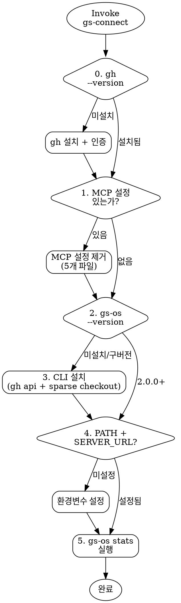

# GS Connect — 온톨로지 CLI 설치 가이드

> **아키텍처 전환 완료 (2026-04-10):** MCP 서버 → REST API + CLI thin client.
> 온톨로지 데이터는 Deploy OS 서버(wiki)가 제공하고, CLI는 서버 API를 호출하는 thin client.

<HARD-GATE>
MCP 서버 설정을 안내하지 마라. MCP는 폐기되었다.
온톨로지 접근은 반드시 gs-os CLI 또는 직접 REST API 호출을 통해서만 안내한다.
</HARD-GATE>

## 체크리스트

완료 순서대로 진행. 건너뛰거나 순서를 바꾸지 않는다.

0. **gh CLI 확인** — `gh --version`으로 설치 여부 확인. 없으면 설치 + 인증.
1. **기존 MCP 설정 제거** — 모든 설정 파일에서 `gs-os-ontology` 관련 항목 제거.
2. **CLI 설치 여부 확인** — `gs-os --version`을 실행하여 이미 설치되어 있는지 확인한다.
3. **CLI 설치** — 미설치 시 설치를 진행한다.
4. **환경변수 확인** — PATH + `GS_OS_SERVER_URL` 설정 확인.
5. **연결 검증** — `gs-os stats`를 실행하여 서버 응답을 확인한다.

## Step 0: gh CLI 확인

```bash
gh --version
```

- 설치되어 있으면 → Step 1로 진행.
- 없으면 먼저 설치:
  - macOS: `brew install gh`
  - Linux: https://github.com/cli/cli/blob/trunk/docs/install_linux.md
  - Windows: `winget install --id GitHub.cli`

설치 후 인증:
```bash
gh auth login
```

> ⚠️ 이 레포는 private이라 `gh`가 필수. curl raw URL은 404가 난다.

## Step 1: 기존 MCP 설정 제거

다음 파일들에서 `gs-os-ontology` 관련 항목이 있으면 **모두** 삭제한다:

| 파일 | 삭제 대상 |
|------|----------|
| `~/.claude.json` | `mcpServers` 객체 안의 `"gs-os-ontology"` 항목 + `disabledMcpServers` 배열 안의 `"gs-os-ontology"` 문자열 |
| `~/.claude/settings.json` | `mcpServers` 안의 `"gs-os-ontology"` 항목 |
| `.claude/settings.json` (프로젝트) | `mcpServers` 안의 `"gs-os-ontology"` 항목 + `enabledMcpjsonServers` 배열 안의 `"gs-os-ontology"` 문자열 |
| `~/Library/Application Support/Claude/claude_desktop_config.json` | `mcpServers` 안의 `"gs-os-ontology"` 항목 |
| `.cursor/mcp.json` | `mcpServers` 안의 `"gs-os-ontology"` 항목 |

삭제 대상 예시 (stdio):
```json
"gs-os-ontology": {
  "command": "node",
  "args": ["..."],
  "env": { ... }
}
```

삭제 대상 예시 (SSE):
```json
"gs-os-ontology": {
  "url": "http://172.x.x.x:3100/sse"
}
```

> **중요:** JSON 구문이 깨지지 않도록 trailing comma를 반드시 확인.

## Step 2: CLI 설치 여부 확인

```bash
gs-os --version
```

- `2.0.0` 이상 → Step 4로 건너뛴다.
- command not found 또는 `1.x.x` → Step 3으로 진행한다.

## Step 3: CLI 설치

### 방법 A: 설치 스크립트 (권장)

```bash
gh api repos/bagelcode-gamestudio/os/contents/gs-os/install.sh --jq '.content' | base64 -d | bash
```

이 스크립트가 자동으로:
- gs-os 코드만 sparse checkout (서브모듈/데이터 불필요)
- npm install && build
- npm link (글로벌 등록)
- 환경변수 설정

### 방법 B: 수동 설치

```bash
# 1. gs-os 폴더만 sparse checkout
git clone --no-checkout --filter=blob:none git@github.com:bagelcode-gamestudio/os.git ~/gs-os-cli
cd ~/gs-os-cli
git sparse-checkout set gs-os
git checkout main

# 2. 빌드 + 글로벌 등록
cd gs-os
npm install && npm run build
npm link
```

### 기존 설치 업데이트 (1.x → 2.x)

```bash
cd ~/gs-os-cli && git pull && cd gs-os && npm install && npm run build
```

## Step 4: 환경변수 확인 (PATH + SERVER_URL)

설치 스크립트가 `.bashrc`에만 PATH를 추가할 수 있으므로, 현재 쉘 RC 파일에 아래 두 항목이 있는지 확인하고 없으면 추가한다.

```bash
# ~/.zshrc (또는 ~/.bashrc)에 아래가 있는지 확인:
export PATH="$HOME/gs-os-cli/bin:$PATH"
export GS_OS_SERVER_URL=https://gs-os-dev.backoffice.bagelgames.com
```

추가 후:
```bash
source ~/.zshrc
```

## Step 5: 연결 검증

현재 세션에서 PATH와 GS_OS_SERVER_URL을 export한 뒤:

```bash
gs-os --version  # 2.0.0 이상
gs-os stats      # total_games 숫자가 나오면 성공
```

정상 응답 예시:
```json
{
  "data": {
    "total_games": 364,
    "total_tags": 85,
    "by_type": { "SLOT_MACHINE": 356, ... }
  }
}
```

에러 시 확인사항:
- `NETWORK_ERROR` → 서버 접근 불가. URL 확인.
- `command not found` → PATH 확인 또는 Step 3 재진행.

## CLI 사용법

```bash
gs-os search "와일드가 확장되는 프리스핀"   # 자연어 검색
gs-os get 272                              # 게임 상세
gs-os similar 272 --limit 5               # 유사 게임
gs-os list --tags free_spin --type SLOT_MACHINE  # 필터 목록
gs-os diff 272 243                         # 두 게임 비교
gs-os dict free_spin                       # 태그 사전
gs-os dict --stats                         # 태그 사용 빈도
gs-os stats                                # 포트폴리오 통계
gs-os stats --group-by game_type           # 그룹별 통계
```

모든 출력은 JSON. AI 에이전트가 `| jq` 파이프로 파싱하기에 최적화.

## REST API 직접 호출 (CLI 없이)

CLI 설치 없이 curl로도 동일한 데이터에 접근 가능:

```bash
curl -s 'https://gs-os-dev.backoffice.bagelgames.com/api/ontology/stats' | jq
curl -s 'https://gs-os-dev.backoffice.bagelgames.com/api/ontology/search?q=프리스핀&limit=5' | jq
curl -s 'https://gs-os-dev.backoffice.bagelgames.com/api/ontology/get/272' | jq
```

## 아키텍처 참조

```
gs-os CLI (thin client)
  └─ HTTP fetch ──→ Wiki 서버 (Deploy OS)
                       └─ /api/ontology/* (7개 엔드포인트)
                            └─ JaccardEngine, SynonymMatcher
                                 └─ output/phase2/*.json (메모리 캐시)
```

| 항목 | 값 |
|------|---|
| 서버 URL | `https://gs-os-dev.backoffice.bagelgames.com` |
| API 베이스 | `/api/ontology/` |
| 인증 | 없음 (내부망) |
| CLI 버전 | 2.0.0 |
| 의존성 | commander.js + Node 18+ built-in fetch |

## Anti-Pattern: "MCP로 하면 안 되나요?"

MCP 서버는 **폐기**되었다. 이유:
- CLI가 MCP 대비 10-32x 토큰 효율적
- 100% 신뢰성 (MCP는 72%)
- 서버 API 기반으로 어디서든 접근 가능 (로컬 데이터 파일 불필요)

MCP 설정을 요청하는 사용자에게는 이 스킬의 Step 1부터 안내한다.

## Process Flow



## Portability Adapter

Claude Code 외 환경에서:

- **Codex CLI / Gemini CLI:** 이 파일을 직접 읽고 체크리스트를 수동으로 따른다.
- **설치 확인:** `gs-os --version`으로 설치 여부 확인.
- **설정 파일 찾기:** `ls`나 `find`로 MCP 설정 파일 위치를 탐색.
- **설정 편집:** 셸 에디터나 리다이렉트로 MCP 설정 제거.
