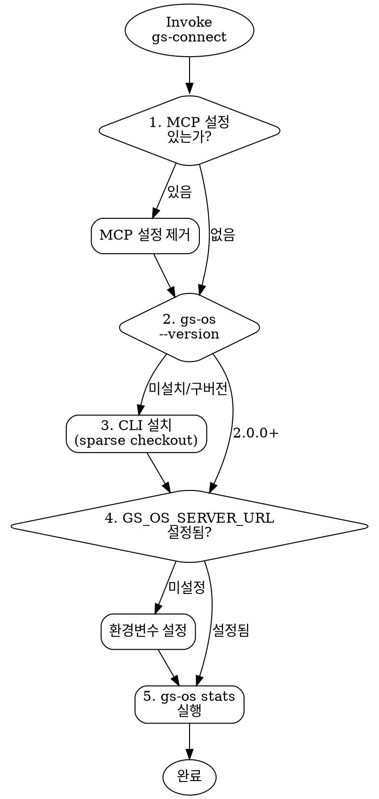

# GS Connect — 온톨로지 CLI 설치 가이드

> **아키텍처 전환 완료 (2026-04-10):** MCP 서버 → REST API + CLI thin client.
> 온톨로지 데이터는 Deploy OS 서버(wiki)가 제공하고, CLI는 서버 API를 호출하는 thin client.

<HARD-GATE>
MCP 서버 설정을 안내하지 마라. MCP는 폐기되었다.
온톨로지 접근은 반드시 gs-os CLI 또는 직접 REST API 호출을 통해서만 안내한다.
</HARD-GATE>

## 체크리스트

완료 순서대로 진행. 건너뛰거나 순서를 바꾸지 않는다.

1. **기존 MCP 설정 제거** — 사용자에게 MCP 설정이 있는지 확인하고 제거를 안내한다.
2. **CLI 설치 여부 확인** — `gs-os --version`을 실행하여 이미 설치되어 있는지 확인한다.
3. **CLI 설치** — 미설치 시 설치를 진행한다.
4. **환경변수 확인** — `GS_OS_SERVER_URL`이 설정되어 있는지 확인한다.
5. **연결 검증** — `gs-os stats`를 실행하여 서버 응답을 확인한다.

## Step 1: 기존 MCP 설정 제거

사용자에게 다음 파일들에서 `gs-os-ontology` 항목이 있는지 확인하도록 안내:

| 클라이언트 | 설정 파일 |
|-----------|----------|
| Claude Desktop | `~/Library/Application Support/Claude/claude_desktop_config.json` |
| Claude Code | `.claude/settings.json` 또는 `~/.claude/settings.json` |
| Cursor | `.cursor/mcp.json` |

해당 항목이 있으면 `mcpServers` 에서 `gs-os-ontology` 키를 삭제한다.

```json
// 이 블록을 삭제:
"gs-os-ontology": {
  "command": "node",
  "args": ["..."],
  "env": { ... }
}
```

SSE 방식도 동일하게 삭제:
```json
// 이 블록도 삭제:
"gs-os-ontology": {
  "url": "http://172.x.x.x:3100/sse"
}
```

## Step 2: CLI 설치 여부 확인

```bash
gs-os --version
```

- `2.0.0` 이상 → Step 4로 건너뛴다.
- command not found → Step 3으로 진행한다.
- `1.x.x` → 구버전. Step 3에서 업데이트한다.

## Step 3: CLI 설치

### 방법 A: 설치 스크립트 (권장)

```bash
bash <(curl -sL https://raw.githubusercontent.com/bagelcode-gamestudio/os/main/gs-os/install.sh)
```

이 스크립트가 자동으로:
- gs-os 코드만 sparse checkout (서브모듈/데이터 불필요)
- npm install && build
- npm link (글로벌 등록)
- 환경변수 설정

### 방법 B: 수동 설치

```bash
# 1. gs-os 폴더만 sparse checkout
git clone --no-checkout --filter=blob:none git@github.com:bagelcode-gamestudio/os.git gs-os-cli
cd gs-os-cli
git sparse-checkout set gs-os
git checkout main

# 2. 빌드 + 글로벌 등록
cd gs-os
npm install && npm run build
npm link
```

### 기존 설치 업데이트 (1.x → 2.x)

기존 gs-os가 로컬 데이터 로딩 방식(v1)인 경우:

```bash
cd <gs-os-cli 설치 경로>
git pull
cd gs-os
npm install && npm run build
```

## Step 4: 환경변수 확인

```bash
echo $GS_OS_SERVER_URL
```

- 값이 출력되면 → Step 5로 진행.
- 비어 있으면 → 설정:

```bash
echo 'export GS_OS_SERVER_URL=https://gs-os-dev.backoffice.bagelgames.com' >> ~/.zshrc
source ~/.zshrc
```

bash 사용자는 `~/.bashrc`에 추가.

## Step 5: 연결 검증

```bash
gs-os stats
```

정상 응답 예시:
```json
{
  "data": {
    "total_games": 364,
    "total_tags": 85,
    "by_type": { "SLOT_MACHINE": 356, ... }
  }
}
```

에러 시 확인사항:
- `NETWORK_ERROR` → 서버 접근 불가. VPN 확인 또는 URL 확인.
- `command not found` → Step 3 재진행.

## CLI 사용법

```bash
gs-os search "와일드가 확장되는 프리스핀"   # 자연어 검색
gs-os get 272                              # 게임 상세
gs-os similar 272 --limit 5               # 유사 게임
gs-os list --tags free_spin --type SLOT_MACHINE  # 필터 목록
gs-os diff 272 243                         # 두 게임 비교
gs-os dict free_spin                       # 태그 사전
gs-os dict --stats                         # 태그 사용 빈도
gs-os stats                                # 포트폴리오 통계
gs-os stats --group-by game_type           # 그룹별 통계
```

모든 출력은 JSON. AI 에이전트가 `| jq` 파이프로 파싱하기에 최적화.

## REST API 직접 호출 (CLI 없이)

CLI 설치 없이 curl로도 동일한 데이터에 접근 가능:

```bash
curl -s 'https://gs-os-dev.backoffice.bagelgames.com/api/ontology/stats' | jq
curl -s 'https://gs-os-dev.backoffice.bagelgames.com/api/ontology/search?q=프리스핀&limit=5' | jq
curl -s 'https://gs-os-dev.backoffice.bagelgames.com/api/ontology/get/272' | jq
```

## 아키텍처 참조

```
gs-os CLI (thin client)
  └─ HTTP fetch ──→ Wiki 서버 (Deploy OS)
                       └─ /api/ontology/* (7개 엔드포인트)
                            └─ JaccardEngine, SynonymMatcher
                                 └─ output/phase2/*.json (메모리 캐시)
```

| 항목 | 값 |
|------|---|
| 서버 URL | `https://gs-os-dev.backoffice.bagelgames.com` |
| API 베이스 | `/api/ontology/` |
| 인증 | 없음 (내부망) |
| CLI 버전 | 2.0.0 |
| 의존성 | commander.js + Node 18+ built-in fetch |

## Anti-Pattern: "MCP로 하면 안 되나요?"

MCP 서버는 **폐기**되었다. 이유:
- CLI가 MCP 대비 10-32x 토큰 효율적
- 100% 신뢰성 (MCP는 72%)
- 서버 API 기반으로 어디서든 접근 가능 (로컬 데이터 파일 불필요)

MCP 설정을 요청하는 사용자에게는 이 스킬의 Step 1부터 안내한다.

## Process Flow



## Portability Adapter

Claude Code 외 환경에서:

- **Codex CLI / Gemini CLI:** 이 파일을 직접 읽고 체크리스트를 수동으로 따른다.
- **설치 확인:** `gs-os --version`으로 설치 여부 확인.
- **설정 파일 찾기:** `ls`나 `find`로 MCP 설정 파일 위치를 탐색.
- **설정 편집:** 셸 에디터나 리다이렉트로 MCP 설정 제거.
