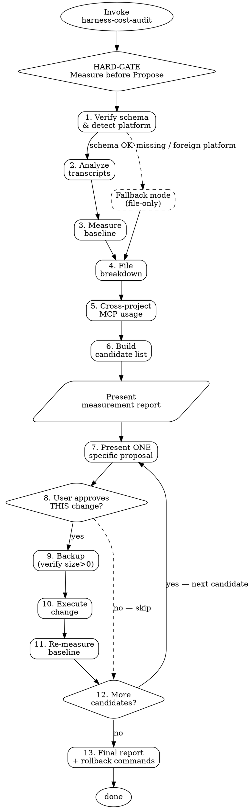

# Harness Cost Audit

<HARD-GATE>
Do NOT propose ANY removal or config change until ALL 5 measurement steps are complete.
Steps: schema-verify → transcript-analyze → baseline-measure → file-breakdown → cross-project-usage → candidate-identification
Recommendations without measurement data are rejected. Generic advice is rejected.
</HARD-GATE>

<HARD-GATE-DESTRUCTIVE>
Do NOT execute deletions, file edits, or config changes until:
1. Timestamped backup created AND verified on disk with non-zero size
2. User has been shown the SPECIFIC proposal: exact file paths, exact content to remove, estimated token savings from actual measurement
3. User has explicitly approved THIS change — prior approval of a sibling change does NOT carry over
Execute ONE change at a time. Re-measure baseline after each. No batching.
</HARD-GATE-DESTRUCTIVE>

## Checklist

Complete every step in order. Do not skip, reorder, or abbreviate.

### Phase 1 — Measurement (gated)

1. **Verify schema & detect platform** — Check `~/.claude/projects/` exists and the latest session file has the required `message.usage` fields (`cache_creation_input_tokens`, `cache_read_input_tokens`). If missing, enter fallback mode per `reference/platform-paths.md`. If `python3` is not on PATH, halt.

2. **Analyze transcripts** — Run `scripts/analyze_transcripts.py <transcript_dir> 15`. Requires ≥10 `.jsonl` sessions for the current project. Produces `/tmp/harness-audit-transcripts.json` with per-turn cost distribution, tool-call frequencies, and top single-turn costs.

3. **Measure baseline** — Run `scripts/measure_baseline.py <transcript_dir> 10`. Extracts the first-turn `cache_creation_input_tokens` across recent sessions. Produces `/tmp/harness-audit-baseline.json` with the session-start fixed cost average.

4. **Break down files** — Run `scripts/file_breakdown.py <project_cwd>`. Measures CLAUDE.md cascade (with `@-imports`), `.claude/rules/*.md`, and the user's memory directory. Produces `/tmp/harness-audit-files.json` ranking files by token estimate.

5. **Cross-project MCP usage** — Run `scripts/cross_project_usage.py`. Aggregates MCP tool calls across ALL projects in `~/.claude/projects/` so we can see whether a globally-configured MCP is used elsewhere. Produces `/tmp/harness-audit-cross-usage.json`.

6. **Build candidate list** — Merge the four measurement artifacts into a single ranked list of reduction candidates. For each candidate record: what it is, why it's a candidate (data!), estimated token savings (measured, not guessed), and safety notes (e.g., "used 14 times in other projects — removing globally breaks those"). *Pause here and present the full measurement report to the user before proceeding to Phase 2.*

### Phase 2 — Proposal & Execution (per-change approval)

7. **Present ONE specific proposal** — Pick the highest-savings candidate from the list. Show exact paths, exact content to remove (or config keys), and measured token savings. Do NOT batch multiple changes.

8. **Wait for explicit approval** — The user must approve THIS specific change. Prior approvals do not transfer. If denied, mark as skipped and move to the next candidate in step 7.

9. **Backup** — Create a timestamped backup: `cp <target> <target>.bak.$(date +%Y%m%d-%H%M%S)`. Verify the backup exists and is non-zero in size with `ls -la`. If verification fails, halt.

10. **Execute the change** — Apply the approved modification. One change only. Do not take initiative on sibling changes.

11. **Re-measure baseline** — Re-run the baseline measurement (`scripts/measure_baseline.py`) on the next session's data where available, OR estimate the delta from the file breakdown. Record the delta.

12. **Loop or exit** — If candidates remain and the user wants to continue, return to step 7 with the next candidate. Otherwise proceed to step 13.

### Phase 3 — Final report

13. **Emit final report** — Produce a report in Korean containing: (a) measured before/after baseline, (b) per-change delta, (c) cumulative savings estimate in USD per session (use pricing table in `reference/pricing.md`), (d) exact rollback commands for every change, (e) recommendations the user declined with the data that motivated them (for future reference).

## Process Flow



## Anti-Pattern: "This Is Too Simple"

Every invocation — no matter how "obviously" the project has unused MCP servers or bloated memory — goes through this full checklist. There are no exceptions.

**Why:** "Obvious" unused items turn out to be the only-sometimes-used-but-critical items in ~15% of real audits. One real case: `pencil` MCP had zero calls in the most recent 30 sessions but 14 historical calls — removing globally would have broken the occasional design workflow. Measurement caught this. Agent intuition did not.

## Rationalization Table

| Excuse | Counter |
|--------|---------|
| "I know common harness issues, I'll skip measurement and go straight to recommendations" | Each project's cost drivers differ — Unity projects NEED unity-bridge MCP (4,684 calls in one real case) but wiki projects don't. Generic advice recommends removing things actively used and misses project-specific high-leverage changes. One real audit found pencil MCP had 14 lifetime calls all in one project — un-measurable without transcript analysis. |
| "Single session sample is enough" | Samples are skewed by recent work. ≥10 sessions needed to distinguish structural patterns from one-off noise. One real audit showed figma MCP used 5 times in 30 sessions (low but nonzero — keep), vs syntaxos with 2 total ever (remove) — single-session data would confuse these. |
| "This is a small config change, no backup needed" | Mandatory backup is not about change size but reversibility. Settings.json corruption breaks Claude Code startup. Cost of timestamped backup: milliseconds. Cost of restoring without one: potentially hours of manual reconstruction. No exceptions. |
| "The user said 'reduce cost' so I have blanket approval to delete unused things" | "Reduce cost" authorizes AUDIT, not execution. Each destructive action needs its own approval with specific proposal shown. "Unused" is a data claim that must be demonstrated with call counts before the user can judge whether to approve. |
| "Prior approval of removing MCP-A covers removing MCP-B" | Sibling approvals do not transfer. Different MCPs may have different meaning to the user (one rarely-used tool may be critical-when-needed). Each change requires its own show-and-approve cycle. |
| "I'll estimate baseline from file sizes rather than measuring" | Baseline includes system prompt + tool schemas + skill metadata + MCP instructions — NONE of which you can see via `wc`. Real measurement uses first-turn `cache_creation_input_tokens` from transcripts. Estimates are systematically wrong by 20–40%. Measurement takes ~30 seconds. |
| "This is obvious, I don't need to show data to the user" | Showing measurement data is how the user builds trust in the recommendation and catches false positives. Hiding data hides errors. One real audit found a "clearly unused" memory file was actually the pointer to an important future TODO — the user caught this because data was shown. |
| "I'm in fallback mode (no transcripts) — I can still recommend MCP removals from file sizes alone" | Fallback mode explicitly FORBIDS usage-based recommendations. MCP removal requires cross-project call-count data from `~/.claude/projects/`. In fallback mode, limit proposals to file-size-based items (memory compression, unused `@-imports`) and mark the report as "partial — no usage data". See `reference/platform-paths.md`. |
| "The user is time-pressed and on a foreign platform — just give my best directional guess" | Directional guesses presented as audit output are worse than no output. The skill's output format requires measured numbers with source paths. In fallback mode, state the degradation and offer only what the available data supports. Let the user decide whether partial analysis is worth executing. |

## Cost estimation formula

For reporting per-session savings after a baseline reduction of `ΔT` tokens, assume the user runs **N-turn sessions** (typical 50–300). Cache-read cost per turn ≈ `ΔT × price_cache_read / 1,000,000`. See `reference/pricing.md` for rates.

Conservative formula (Opus 4.x):

```
Δ$ per session ≈ ΔT × 1.5 × N / 1,000,000
```

Example: removing a 5,500-token imported file from a 300-turn Opus session saves ~$2.48.

## References

See [scripts/analyze_transcripts.py](scripts/analyze_transcripts.py) — per-turn cost & tool-call analyzer.
See [scripts/measure_baseline.py](scripts/measure_baseline.py) — first-turn baseline measurer.
See [scripts/file_breakdown.py](scripts/file_breakdown.py) — CLAUDE.md / memory / rules token estimator.
See [scripts/cross_project_usage.py](scripts/cross_project_usage.py) — MCP usage aggregator across projects.
See [reference/pricing.md](reference/pricing.md) — current price table + update procedure.
See [reference/platform-paths.md](reference/platform-paths.md) — Claude Code / Codex / Gemini path reference + fallback-mode triggers.

## Portability Adapter

When operating outside Claude Code (e.g. Codex CLI, Gemini CLI):

- **Skill tool:** Not available. Follow this checklist manually by reading this file and running the scripts directly (`python3 scripts/<name>.py`).
- **Agent / TaskCreate:** Not available. Execute steps sequentially and print `[STEP N/13]` status lines to stdout as you progress.
- **`~/.claude/projects/` transcripts:** Not available on Codex / Gemini. Enter fallback mode at step 1 — skip steps 2, 3, 5 (transcript-dependent). Report this degradation explicitly to the user.
- **`~/.claude.json` MCP config:** Path differs per platform. At step 5, halt MCP-removal recommendations if the config path cannot be located. Do NOT guess paths.
- **Read / Write / Edit tools:** Use `cat`, shell heredocs (`cat > file << 'EOF'`), and `sed -i` as fallbacks.
- **Pricing table:** Hardcoded in `scripts/analyze_transcripts.py` with a `PRICE_VERSION` constant. Update per `reference/pricing.md` procedure when Anthropic rates change.
- **Minimum denominator:** the skill requires file-read, shell, and python3. If python3 is unavailable, the skill cannot function — halt and instruct the user to install it.
