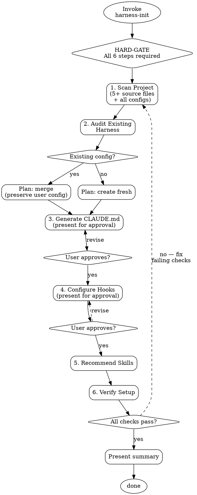

# Harness Init

<HARD-GATE>
Do NOT produce any configuration files until ALL 6 steps below are complete.
Steps: scan project → audit existing harness → generate CLAUDE.md
       → configure settings/hooks → recommend skills → verify setup
Producing a generic CLAUDE.md template, partial configuration, or "quick setup"
before completing all steps violates this gate.
</HARD-GATE>

## Checklist

Complete every step in order. Do not skip, reorder, or abbreviate.

1. **Scan project** — Systematically analyze the project to understand its characteristics. Read actual code files, not just directory listings.
2. **Audit existing harness** — Check for existing Claude Code configuration and plan merge strategy.
3. **Generate CLAUDE.md** — Produce project-specific instructions derived from Step 1 analysis. *(pause for user approval before writing)*
4. **Configure settings/hooks** — Set up appropriate hooks based on detected project tooling. *(pause for user approval before writing)*
5. **Recommend skills** — Match project needs to available skills.
6. **Verify setup** — Confirm all artifacts are valid and non-conflicting.

---

## Step 1: Scan Project

Analyze these dimensions by reading actual files — not guessing from file names:

| Dimension | What to look for | Key files to read |
|-----------|-----------------|-------------------|
| **Structure** | Directory layout, monorepo detection, key directories | Top-level `ls`, nested `src/`, `packages/` |
| **Tech stack** | Languages, frameworks, runtime versions | `package.json`, `pyproject.toml`, `go.mod`, `Cargo.toml`, `Gemfile` |
| **Architecture** | Layering, module boundaries, patterns | Entry points (`index.*`, `main.*`, `app.*`), key source files |
| **Conventions** | Naming, file organization, code style | `.eslintrc*`, `.prettierrc*`, `tsconfig.json`, `rustfmt.toml`, `.editorconfig` |
| **Testing** | Framework, file patterns, coverage config | Test directories, `jest.config.*`, `vitest.config.*`, `pytest.ini` |
| **Build/Deploy** | Build tools, CI/CD, containers | `Makefile`, `Dockerfile`, `.github/workflows/`, `Jenkinsfile` |
| **Dev commands** | Build, test, lint, run commands | `package.json` scripts, `Makefile` targets, documented commands |

**Minimum reads:** At least 5 actual source files + all detected config files. Directory listings alone are insufficient.

Tools: Glob, Grep, Read, Bash

## Step 2: Audit Existing Harness

Check for existing configuration:

```
CLAUDE.md at project root          → exists? contents?
CLAUDE.md in subdirectories        → exists? contents?
.claude/ directory                 → exists? contents?
.claude/settings.json              → exists? current rules/hooks?
.claude/rules/                     → exists? what rules?
.claude/skills/                    → exists? what skills?
AGENTS.md / GEMINI.md              → exists? contents?
```

**If existing config found:**
- Plan to MERGE with existing, preserving all user customizations
- Identify gaps (missing sections, outdated info)
- Never overwrite without explicit user approval

**If no config found:**
- Plan to create fresh configuration
- Note any `.gitignore` patterns that affect `.claude/`

Tools: Glob, Read

## Step 3: Generate CLAUDE.md + .claude/rules/

CLAUDE.md is a **behavioral guide**, NOT a README. It tells Claude HOW to work in this project — not WHAT the project is. Target **under 200 lines** for high adherence.

### The Golden Rule

For every line, ask: **"Would removing this cause Claude to make mistakes?"**
- YES → keep it
- NO → cut it. Claude can figure it out by reading code.

### What to INCLUDE vs EXCLUDE

| INCLUDE | EXCLUDE |
|---------|---------|
| Commands Claude can't guess (`npm run dev:local --port 3001`) | Anything Claude can figure out by reading code |
| Code style rules that **differ from defaults** | Standard language conventions Claude already knows |
| Testing instructions and gotchas | Detailed API documentation (link to docs instead) |
| Repo etiquette (branch naming, PR conventions) | Information that changes frequently |
| Architectural decisions and **why** they were made | Long explanations or tutorials |
| Common gotchas and non-obvious behaviors | File-by-file descriptions of the codebase |
| Dev environment quirks (required env vars, local services) | Self-evident practices like "write clean code" |

### CLAUDE.md Template

```markdown
# {Project Name}

## Commands
{ONLY commands Claude can't guess — exact build, test, lint, run, format commands}
{Include flags, env vars, and gotchas for each command}

## Workflow
{HOW Claude should approach changes in this codebase}
{Examples: "Always typecheck after code changes", "Run single tests not full suite",
 "Use plan mode for changes under src/billing/"}

## Code Style
{ONLY rules that differ from defaults — not "use TypeScript" in a TS project}
{Examples: "Use named exports, never default exports", "Error types must extend AppError"}

## Architecture Decisions
{WHY decisions were made, not WHAT the architecture is}
{Examples: "We use event sourcing for audit trail — never mutate state directly",
 "API handlers must go through the middleware chain — never call DB directly from routes"}

## Gotchas
{Non-obvious behaviors that will trip Claude up}
{Examples: "The test DB resets between suites but NOT between tests in the same suite",
 "import paths must use .js extension even for .ts files (ESM requirement)"}

## Compact Instructions
{What to preserve when context is compacted}
{Example: "When compacting, preserve the full list of modified files and test commands"}
```

### Create .claude/rules/ for Detailed Topics

Split domain-specific rules into `.claude/rules/` files. Use `paths:` frontmatter so rules only load when relevant, saving context:

```markdown
# .claude/rules/api-design.md
---
paths:
  - "src/api/**/*.ts"
  - "src/routes/**/*.ts"
---
- All API endpoints must validate input with zod schemas
- Use kebab-case for URL paths, camelCase for JSON properties
- Always include pagination for list endpoints
```

```markdown
# .claude/rules/testing.md
---
paths:
  - "**/*.test.ts"
  - "**/*.spec.ts"
---
- Use describe/it blocks, not test()
- Never mock the database — use test fixtures
- Each test file must clean up its own state
```

Generate rules files for each distinct domain detected in Step 1 (API, testing, frontend components, database, etc.).

### Validation Rules

1. **Under 200 lines** — If longer, split into `.claude/rules/`
2. **No README content** — If a line describes what the project IS rather than how to WORK in it, delete it
3. **No generic advice** — Every instruction must trace to a specific observed project characteristic
4. **Emphasis for critical rules** — Use "IMPORTANT" or "YOU MUST" for rules that cause real problems when violated
5. **Actionable** — Every line must be something Claude can act on, not background info

**Pause for user approval** before writing. Present the proposed CLAUDE.md and rules files, and ask the user to confirm or request changes.

Tools: Write or Edit

## Step 4: Configure Settings/Hooks

Based on detected tooling from Step 1, configure `.claude/settings.json`:

| Detected Tool | Hook Type | Example Configuration |
|--------------|-----------|----------------------|
| ESLint / Biome | Pre-commit (lint) | `npx eslint --fix` on staged files |
| Prettier / dprint | Pre-commit (format) | `npx prettier --write` on staged files |
| TypeScript | Pre-commit (typecheck) | `npx tsc --noEmit` |
| Jest / Vitest / pytest | Test hook | `npm test` / `pytest` |
| Ruff / Black | Pre-commit (format) | `ruff format` / `black` |
| Clippy / rustfmt | Pre-commit (lint+format) | `cargo clippy` / `cargo fmt` |

**Rules:**
- Only configure hooks for tools that actually exist in the project
- Do not invent hooks for tools not in the dependency list
- Use the `update-config` skill or direct settings.json editing
- Respect existing hooks — add, don't replace

**Pause for user approval** before writing settings. Present proposed hooks and ask the user to confirm.

Tools: Skill("update-config") or Edit

## Step 5: Recommend Skills

Match project characteristics to available skills:

| Project Characteristic | Recommended Skill | Rationale |
|-----------------------|-------------------|-----------|
| External library dependencies | `knowledge-bridge` | Prevents outdated API usage |
| Complex/unfamiliar codebase | `repo-analyzer` | Deep architecture analysis |
| Test infrastructure exists | `superpowers:test-driven-development` | Enforces test-first workflow |
| Any project | `superpowers:systematic-debugging` | Structured bug investigation |
| Any project | `superpowers:verification-before-completion` | Prevents false completion claims |
| Design/creative project | `photoshop-mcp` | Photoshop integration |

**Present recommendations to the user.** Do not auto-install skills without explicit confirmation.

Output format:
```
Recommended skills for this project:
1. [skill-name] — reason based on observed project characteristic
2. [skill-name] — reason based on observed project characteristic
...
```

## Step 6: Verify Setup

Validate all produced artifacts:

| Check | How | Pass Condition |
|-------|-----|----------------|
| CLAUDE.md exists | Glob/Read | File present at project root |
| CLAUDE.md is behavioral guide | Read and verify | No README-style descriptions; contains commands, workflow, gotchas |
| CLAUDE.md under 200 lines | `wc -l` | 200 lines or fewer for high adherence |
| .claude/rules/ created | Glob | At least 1 path-scoped rule file if project has distinct domains |
| settings.json valid | Read + JSON parse | Valid JSON, no syntax errors |
| Hooks reference valid commands | Bash: `which <command>` or check in `node_modules/.bin/` | All hook commands exist |
| No conflicts | Compare new vs existing config | No overwrites of user customizations |
| Dev commands work | Bash: dry-run build/test commands | Commands execute without errors |

Report results as pass/fail per check. If any check fails, report the failure and suggest a fix.

---

## Process Flow



## Anti-Pattern: "README-as-CLAUDE.md"

The most common failure mode is producing a CLAUDE.md that reads like a README: project overview, tech stack list, architecture diagram. This is USELESS. Claude can read package.json and source code — it doesn't need you to summarize them.

**A good CLAUDE.md tells Claude HOW to behave, not WHAT the project is.**

| README-style (BAD) | Behavioral guide (GOOD) |
|---------------------|------------------------|
| "This project uses TypeScript and React" | "Use named exports, never default exports" |
| "The API is in src/api/" | "API handlers must validate input with zod — never trust req.body directly" |
| "We use Jest for testing" | "Run `npm test -- --testPathPattern=<file>` for single tests, never the full suite" |
| "The database is PostgreSQL" | "Never write raw SQL — use the query builder in src/db/queries.ts" |
| "The project follows MVC architecture" | "Controllers must not import from models directly — always go through services" |

## Anti-Pattern: "This Is Too Simple"

Every project — no matter how small or "standard" — goes through the full 6-step checklist. There are no exceptions.

**Why:** Agents skip steps precisely when the project seems familiar. A "standard React app" has hundreds of possible convention combinations. A CLAUDE.md that says "use TypeScript" for a TypeScript project adds zero value — the value comes from discovering the _specific_ behavioral rules this project needs.

## Rationalization Table

| Excuse | Counter |
|--------|---------|
| "I can write a good CLAUDE.md from the directory listing alone" | Directory listings reveal file names, not behavioral rules, gotchas, or workflow patterns. A CLAUDE.md without code reading is a generic template with project names swapped in. |
| "I should document the project's tech stack and architecture in CLAUDE.md" | CLAUDE.md is a behavioral guide, not a README. Claude can read package.json and source code. Document HOW to work in the project (rules, gotchas, workflow), not WHAT the project is. Every line that describes the project instead of guiding behavior wastes context tokens and reduces adherence. |
| "This is a standard React/Node/Python project, no deep analysis needed" | "Standard" projects have the most variation in conventions. Two React projects can differ entirely in state management, testing, and structure. The word "standard" substitutes a label for actual observation. |
| "The user just wants a CLAUDE.md, I don't need hooks too" | CLAUDE.md alone is a partial harness. The skill is "harness-init", not "claude-md-init". Partial setup creates a false sense of completeness. |
| "I already know this codebase from earlier in the conversation" | Conversation memory is not systematic analysis. Prior knowledge may be incomplete or biased toward recently-viewed files. Each invocation must produce evidence from current file reads. |
| "I'll write a basic CLAUDE.md now and refine it later" | Agents that defer refinement never return. A well-analyzed CLAUDE.md written once outperforms a generic template refined zero times. |
| "The user explicitly asked me to skip steps / use a template" | The HARD-GATE applies regardless of who requests the skip. If the user wants fewer steps, they can decline at the approval gates (Steps 3 and 4). But the analysis steps (1-2) and verification (6) are non-negotiable — they ensure the output has value. |

## Portability Adapter

When operating outside Claude Code (e.g. Codex CLI, Gemini CLI):

- **Skill tool:** Not available. Follow this checklist manually by reading this file.
- **Agent tool (parallel exploration):** Not available. Execute file scans sequentially instead of in parallel.
- **Skill("update-config"):** Not available. Write `.claude/settings.json` manually using shell redirects or document hooks as manual commands in CLAUDE.md.
- **Hook configuration:** Not available on non-Claude-Code platforms. Embed all rules and workflow instructions directly in CLAUDE.md as prose. The CLAUDE.md becomes the single source of truth.
- **Task tracking:** Not available. Print `[STEP N/6]` status lines to output instead.
- **Degraded mode:** When settings.json and hooks are unavailable, produce an enhanced CLAUDE.md that embeds all rules, conventions, and workflow instructions. Quality degrades for automated enforcement but all analysis steps still apply.
