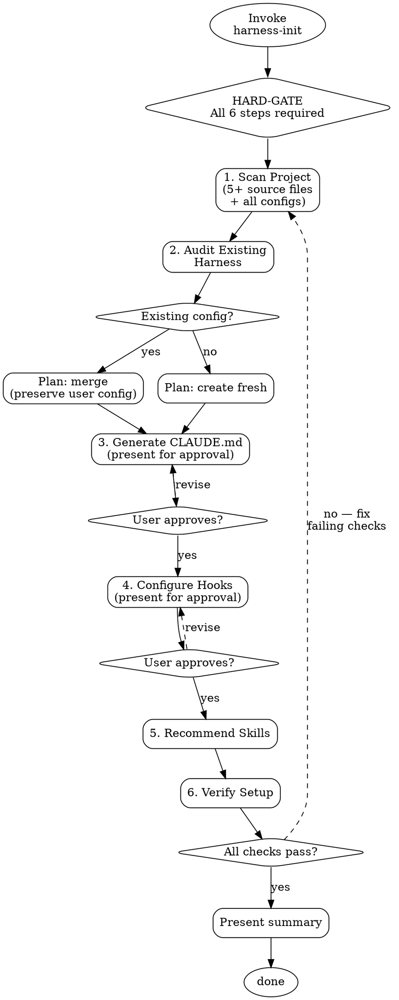

# Harness Init

<HARD-GATE>
Do NOT produce any configuration files until ALL 6 steps below are complete.
Steps: scan project → audit existing harness → generate CLAUDE.md
       → configure settings/hooks → recommend skills → verify setup
Producing a generic CLAUDE.md template, partial configuration, or "quick setup"
before completing all steps violates this gate.
</HARD-GATE>

## Checklist

Complete every step in order. Do not skip, reorder, or abbreviate.

1. **Scan project** — Systematically analyze the project to understand its characteristics. Read actual code files, not just directory listings.
2. **Audit existing harness** — Check for existing Claude Code configuration and plan merge strategy.
3. **Generate CLAUDE.md** — Produce project-specific instructions derived from Step 1 analysis. *(pause for user approval before writing)*
4. **Configure settings/hooks** — Set up appropriate hooks based on detected project tooling. *(pause for user approval before writing)*
5. **Recommend skills** — Match project needs to available skills.
6. **Verify setup** — Confirm all artifacts are valid and non-conflicting.

---

## Step 1: Scan Project

Analyze these dimensions by reading actual files — not guessing from file names:

| Dimension | What to look for | Key files to read | Feeds into (Step 3) |
|-----------|-----------------|-------------------|---------------------|
| **Config non-defaults** | Linter/formatter/compiler settings that differ from tool defaults | `.eslintrc*`, `.prettierrc*`, `tsconfig.json`, `biome.json`, `.editorconfig` | Code Style rules |
| **Code patterns** | Repeated import styles, error handling, naming across modules | 5+ source files from different directories | Code Style / Architecture rules |
| **Module boundaries** | Which modules import from which, layering, forbidden cross-imports | Entry points + key source files in each `src/` subdirectory | Architecture Decisions |
| **Package scripts** | Exact build/test/lint/run commands with flags and env vars | `package.json` scripts, `Makefile` targets | Commands section |
| **CI pipeline** | Required checks, step order, branch rules | `.github/workflows/`, `Jenkinsfile`, `.gitlab-ci.yml` | Workflow rules |
| **Environment deps** | Required env vars, local services, setup prerequisites | `.env.example`, `docker-compose.yml`, README setup section | Commands / Gotchas |
| **Test conventions** | Mock vs fixture, test file patterns, framework-specific idioms | Test files, `jest.config.*`, `vitest.config.*`, `pytest.ini`, fixtures dir | .claude/rules/testing.md |
| **Error handling** | Custom error classes, catch patterns, error middleware | Error files, middleware, catch blocks across codebase | Code Style / rules/ |
| **Non-obvious behaviors** | Comments with NOTE/HACK/WORKAROUND/TODO, known gotchas | README troubleshooting, inline comments, git blame for reverts | Gotchas section |

**Minimum reads:** At least 5 actual source files + all detected config files. Directory listings alone are insufficient.

**Goal of scanning:** Every observation here must feed into a concrete behavioral rule in Step 3. If an observation doesn't produce a rule, it was unnecessary.

Tools: Glob, Grep, Read, Bash

## Step 2: Audit Existing Harness

Check for existing configuration:

```
CLAUDE.md at project root          → exists? contents?
CLAUDE.md in subdirectories        → exists? contents?
.claude/ directory                 → exists? contents?
.claude/settings.json              → exists? current rules/hooks?
.claude/rules/                     → exists? what rules?
.claude/skills/                    → exists? what skills?
AGENTS.md / GEMINI.md              → exists? contents?
```

**If existing config found:**
- Plan to MERGE with existing, preserving all user customizations
- Identify gaps (missing sections, outdated info)
- Never overwrite without explicit user approval

**If no config found:**
- Plan to create fresh configuration
- Note any `.gitignore` patterns that affect `.claude/`

Tools: Glob, Read

## Step 3: Generate CLAUDE.md + .claude/rules/

CLAUDE.md is a **behavioral guide**, NOT a README. It tells Claude HOW to work in this project — not WHAT the project is. Target **under 200 lines** for high adherence.

### The Golden Rule

For every line, ask: **"Would removing this cause Claude to make mistakes?"**
- YES → keep it
- NO → cut it. Claude can figure it out by reading code.

### Pattern → Rule Derivation Framework

Behavioral rules are not invented — they are **derived from observed patterns**. For each source below, apply the conversion method to produce actionable rules.

| # | Observation Source | What to Read | Conversion Method | Output Section |
|---|-------------------|-------------|-------------------|----------------|
| 1 | **Config non-defaults** | `.eslintrc`, `.prettierrc`, `tsconfig.json`, `biome.json`, `rustfmt.toml` | Extract every setting that **differs from tool defaults** → convert to imperative instruction | Code Style |
| 2 | **Repeated code patterns** | 5+ source files across different modules | Identify patterns present in **all or most** files (import style, error handling, naming) → "Always do X" | Code Style |
| 3 | **Module boundaries** | Import graph across `src/` directories | Identify which modules import from which → "Never import X from Y directly" | Architecture Decisions |
| 4 | **Package scripts & Makefile** | `package.json` scripts, `Makefile` targets | Extract exact commands with flags → include env vars and gotchas | Commands |
| 5 | **CI pipeline** | `.github/workflows/`, `Jenkinsfile`, `.gitlab-ci.yml` | Extract step order and required checks → "Always X before Y" | Workflow |
| 6 | **Environment dependencies** | `.env.example`, `docker-compose.yml`, README setup section | Identify required services and env vars → "IMPORTANT: must set X" | Commands / Gotchas |
| 7 | **Test conventions** | Test files, test config, fixtures directory | Identify test style (mock vs fixture, describe/it vs test) → "Use X, never Y" | .claude/rules/testing.md |
| 8 | **Error handling patterns** | `catch` blocks, custom error classes, error middleware | Identify consistent patterns → "Throw X, handle with Y" | .claude/rules/ or Code Style |
| 9 | **Non-obvious behaviors** | README troubleshooting, comments with "NOTE"/"HACK"/"WORKAROUND" | Identify gotchas that would trip up a newcomer | Gotchas |

**Derivation rule:** For rows 1-9, if you cannot point to the specific file + line where you observed the pattern, do not write the rule.

### Behavioral Rules: 3-Layer System

Generate `.claude/rules/` files from three layers. Each layer adds rules — they don't replace each other.

**Layer 1: Generic (always apply)**

Every project gets these. They prevent universal agent failure patterns.

```markdown
# .claude/rules/agent-behavior.md
# Debugging
- ALWAYS find the root cause before giving a solution. Patching without understanding is not allowed.
- Do not suppress errors with try/catch to hide failures. Fix the source.
- If a test fails, diagnose why — do not weaken the test or change timeouts to fake a pass.

# Testing integrity
- Never modify existing tests to make them pass — fix the implementation instead.
- Write a failing test that reproduces the bug BEFORE fixing it.
- No mock-echo tests: if removing the code under test wouldn't fail the test, the test is worthless.
- Test behavior, not implementation details.

# Completion
- Do not claim "done" without running the test/lint suite and showing the output.
- Do what was asked, nothing more. No gold-plating, no unrequested refactors.
```

**Layer 2: Tech Stack (match detected stack)**

Select rules matching the tech stack found in Step 1. Only include sections that apply.

| Tech Stack | Rules to add | File |
|-----------|-------------|------|
| **TypeScript/JavaScript** | Strict mode, no `any`, prefer `unknown`. No `console.log` in production — use a logger. Check `tsconfig.json` strictness and enforce it. | `.claude/rules/typescript.md` |
| **React/Frontend** | Test user behavior not component internals. Use Testing Library queries (getByRole > getByTestId). No snapshot tests unless explicitly requested. | `.claude/rules/frontend.md` |
| **Python** | Type hints on public functions. Use `pytest` fixtures over `setUp`/`tearDown`. No bare `except:`. | `.claude/rules/python.md` |
| **Rust** | Run `cargo clippy` before suggesting code. Use `thiserror` for library errors, `anyhow` for application errors. No `unwrap()` in production code. | `.claude/rules/rust.md` |
| **Go** | Handle every error — no `_` for errors. Table-driven tests. `golangci-lint` before commit. | `.claude/rules/go.md` |
| **Database/ORM** | Never write raw SQL if an ORM/query builder exists. Always use transactions for multi-step writes. Test with real DB, not mocks. | `.claude/rules/database.md` |
| **API/Backend** | Validate all inputs at the boundary. Never trust request bodies. Use typed error responses. | `.claude/rules/api.md` |

Customize these based on what the project's config files actually enforce. If `tsconfig.json` has `strict: false`, don't add strict mode rules.

**Layer 3: Project-specific (from Step 1 analysis)**

Derived from the 9 observation sources in the Derivation Framework above. These are unique to this project.

### What to INCLUDE vs EXCLUDE

| INCLUDE | EXCLUDE |
|---------|---------|
| Commands Claude can't guess (`npm run dev:local --port 3001`) | Anything Claude can figure out by reading code |
| Code style rules that **differ from defaults** | Standard language conventions Claude already knows |
| Testing instructions and gotchas | Detailed API documentation (link to docs instead) |
| Repo etiquette (branch naming, PR conventions) | Information that changes frequently |
| Architectural decisions and **why** they were made | Long explanations or tutorials |
| Common gotchas and non-obvious behaviors | File-by-file descriptions of the codebase |
| Dev environment quirks (required env vars, local services) | Self-evident practices like "write clean code" |

### CLAUDE.md Template

Modeled after Anthropic's own CLAUDE.md files and well-maintained open source projects (Deno, LangChain). Sections are ordered by priority — commands first, gotchas before conventions.

```markdown
# {Project Name}

## Commands
{Exact build, test, lint, run, format commands — only those Claude can't guess}
{Include flags, env vars, and per-command gotchas}

## What This Is
{1-3 sentences: what the project does, how it runs, single entrypoint if applicable}
{Brief, factual, no marketing copy}

## How It Works
{Key directories, entrypoints, and data flow — HOW the system is organized}
{NOT what every file does — just enough to navigate confidently}

## Things That Will Bite You
{Non-obvious behaviors, tribal knowledge, common mistakes}
{This is the highest-value section — encode what a new contributor learns the hard way}

## Code Conventions
{ONLY rules that differ from defaults — imperative tone, no explanations}
{Example: "Runtime is Bun, not Node. Use bun test, not jest."}

## Workflow
{Branch naming, PR conventions, CI checks, deployment rules — if applicable}
```

**Tone:** Imperative, factual, minimal prose. "moduleResolution: bundler — imports don't need .js extensions." Not "Please make sure to use the correct module resolution setting."

**Length guide:**
- Simple projects: 10-60 lines
- Medium projects: 60-150 lines
- Complex projects: 150-300 lines (split overflow to `.claude/rules/`)

### Create .claude/rules/ for Detailed Topics

Split domain-specific rules into `.claude/rules/` files. Use `paths:` frontmatter so rules only load when relevant, saving context:

```markdown
# .claude/rules/api-design.md
---
paths:
  - "src/api/**/*.ts"
  - "src/routes/**/*.ts"
---
- All API endpoints must validate input with zod schemas
- Use kebab-case for URL paths, camelCase for JSON properties
- Always include pagination for list endpoints
```

```markdown
# .claude/rules/testing.md
---
paths:
  - "**/*.test.ts"
  - "**/*.spec.ts"
---
- Use describe/it blocks, not test()
- Never mock the database — use test fixtures
- Each test file must clean up its own state
```

Generate rules files for each distinct domain detected in Step 1 (API, testing, frontend components, database, etc.).

### Validation Rules

1. **Length proportional to complexity** — Simple: 10-60, Medium: 60-150, Complex: 150-300 lines. Overflow goes to `.claude/rules/`
2. **Commands section exists and is first** — Claude needs build/test/lint commands above all else
3. **"Things That Will Bite You" section exists** — If you found zero gotchas, you didn't scan deeply enough
4. **No generic advice** — Every instruction must trace to a specific observed project characteristic
5. **Imperative factual tone** — Short declarative sentences, no tutorials, no personality instructions
6. **Emphasis for critical rules** — Use "IMPORTANT" or "YOU MUST" sparingly, only for rules that cause real breakage

**Pause for user approval** before writing. Present the proposed CLAUDE.md and rules files, and ask the user to confirm or request changes.

Tools: Write or Edit

## Step 4: Configure Settings/Hooks

Based on detected tooling from Step 1, configure `.claude/settings.json`:

| Detected Tool | Hook Type | Example Configuration |
|--------------|-----------|----------------------|
| ESLint / Biome | Pre-commit (lint) | `npx eslint --fix` on staged files |
| Prettier / dprint | Pre-commit (format) | `npx prettier --write` on staged files |
| TypeScript | Pre-commit (typecheck) | `npx tsc --noEmit` |
| Jest / Vitest / pytest | Test hook | `npm test` / `pytest` |
| Ruff / Black | Pre-commit (format) | `ruff format` / `black` |
| Clippy / rustfmt | Pre-commit (lint+format) | `cargo clippy` / `cargo fmt` |

**Rules:**
- Only configure hooks for tools that actually exist in the project
- Do not invent hooks for tools not in the dependency list
- Use the `update-config` skill or direct settings.json editing
- Respect existing hooks — add, don't replace

**Pause for user approval** before writing settings. Present proposed hooks and ask the user to confirm.

Tools: Skill("update-config") or Edit

## Step 5: Recommend Skills

Match project characteristics to available skills:

| Project Characteristic | Recommended Skill | Rationale |
|-----------------------|-------------------|-----------|
| External library dependencies | `knowledge-bridge` | Prevents outdated API usage |
| Complex/unfamiliar codebase | `repo-analyzer` | Deep architecture analysis |
| Test infrastructure exists | `superpowers:test-driven-development` | Enforces test-first workflow |
| Any project | `superpowers:systematic-debugging` | Structured bug investigation |
| Any project | `superpowers:verification-before-completion` | Prevents false completion claims |
| Design/creative project | `photoshop-mcp` | Photoshop integration |

**Present recommendations to the user.** Do not auto-install skills without explicit confirmation.

Output format:
```
Recommended skills for this project:
1. [skill-name] — reason based on observed project characteristic
2. [skill-name] — reason based on observed project characteristic
...
```

## Step 6: Verify Setup

Validate all produced artifacts:

| Check | How | Pass Condition |
|-------|-----|----------------|
| CLAUDE.md exists | Glob/Read | File present at project root |
| CLAUDE.md has Commands first | Read | Commands section exists and is the first content section |
| CLAUDE.md has Gotchas | Read | "Things That Will Bite You" section with at least 2 non-obvious items |
| CLAUDE.md length proportional | `wc -l` | Simple: <60, Medium: <150, Complex: <300 lines |
| .claude/rules/ created | Glob | At least 1 path-scoped rule file if project has distinct domains |
| settings.json valid | Read + JSON parse | Valid JSON, no syntax errors |
| Hooks reference valid commands | Bash: `which <command>` or check in `node_modules/.bin/` | All hook commands exist |
| No conflicts | Compare new vs existing config | No overwrites of user customizations |
| Dev commands work | Bash: dry-run build/test commands | Commands execute without errors |

Report results as pass/fail per check. If any check fails, report the failure and suggest a fix.

---

## Process Flow



## Anti-Pattern: "README-as-CLAUDE.md"

The most common failure mode is producing a CLAUDE.md that reads like a README: listing tech stack, describing every file, writing marketing copy. Some project context is needed (see "What This Is" and "How It Works" sections), but it should be **brief and factual**, not exhaustive.

**Test each line:** Does this help Claude **do work**, or does it just describe the project?

| Descriptive (low value) | Actionable (high value) |
|-------------------------|------------------------|
| "This project uses TypeScript and React" | "Runtime is Bun, not Node. Use bun test, not jest." |
| "The API is in src/api/" | "API handlers must validate input with zod — never trust req.body directly" |
| "We use Jest for testing" | "Run `npm test -- --testPathPattern=<file>` for single tests, never the full suite" |
| "The database is PostgreSQL" | "Never write raw SQL — use the query builder in src/db/queries.ts" |
| "Authentication uses JWT tokens" | "Token lifecycle matters: obtained early, revoked in always() step. Don't skip revocation." |

## Anti-Pattern: "This Is Too Simple"

Every project — no matter how small or "standard" — goes through the full 6-step checklist. There are no exceptions.

**Why:** Agents skip steps precisely when the project seems familiar. A "standard React app" has hundreds of possible convention combinations. A CLAUDE.md that says "use TypeScript" for a TypeScript project adds zero value — the value comes from discovering the _specific_ behavioral rules this project needs.

## Rationalization Table

| Excuse | Counter |
|--------|---------|
| "I can write a good CLAUDE.md from the directory listing alone" | Directory listings reveal file names, not behavioral rules, gotchas, or workflow patterns. A CLAUDE.md without code reading is a generic template with project names swapped in. |
| "I should document the project's tech stack and architecture in CLAUDE.md" | CLAUDE.md is a behavioral guide, not a README. Claude can read package.json and source code. Document HOW to work in the project (rules, gotchas, workflow), not WHAT the project is. Every line that describes the project instead of guiding behavior wastes context tokens and reduces adherence. |
| "This is a standard React/Node/Python project, no deep analysis needed" | "Standard" projects have the most variation in conventions. Two React projects can differ entirely in state management, testing, and structure. The word "standard" substitutes a label for actual observation. |
| "The user just wants a CLAUDE.md, I don't need hooks too" | CLAUDE.md alone is a partial harness. The skill is "harness-init", not "claude-md-init". Partial setup creates a false sense of completeness. |
| "I already know this codebase from earlier in the conversation" | Conversation memory is not systematic analysis. Prior knowledge may be incomplete or biased toward recently-viewed files. Each invocation must produce evidence from current file reads. |
| "I'll write a basic CLAUDE.md now and refine it later" | Agents that defer refinement never return. A well-analyzed CLAUDE.md written once outperforms a generic template refined zero times. |
| "The user explicitly asked me to skip steps / use a template" | The HARD-GATE applies regardless of who requests the skip. If the user wants fewer steps, they can decline at the approval gates (Steps 3 and 4). But the analysis steps (1-2) and verification (6) are non-negotiable — they ensure the output has value. |

## Portability Adapter

When operating outside Claude Code (e.g. Codex CLI, Gemini CLI):

- **Skill tool:** Not available. Follow this checklist manually by reading this file.
- **Agent tool (parallel exploration):** Not available. Execute file scans sequentially instead of in parallel.
- **Skill("update-config"):** Not available. Write `.claude/settings.json` manually using shell redirects or document hooks as manual commands in CLAUDE.md.
- **Hook configuration:** Not available on non-Claude-Code platforms. Embed all rules and workflow instructions directly in CLAUDE.md as prose. The CLAUDE.md becomes the single source of truth.
- **Task tracking:** Not available. Print `[STEP N/6]` status lines to output instead.
- **Degraded mode:** When settings.json and hooks are unavailable, produce an enhanced CLAUDE.md that embeds all rules, conventions, and workflow instructions. Quality degrades for automated enforcement but all analysis steps still apply.
