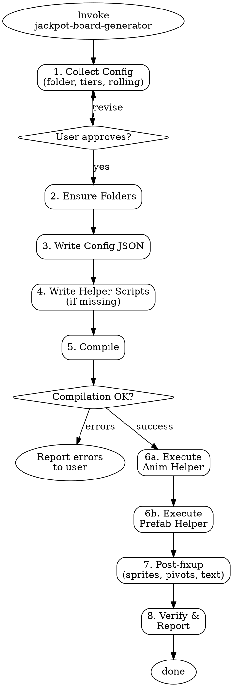

# Jackpot Board Generator

<HARD-GATE>
Do NOT create any Unity assets until ALL 8 checklist steps below are completed in order.
Steps: collect config → ensure folders → write config JSON → write helper scripts (if missing) →
       compile → execute helpers → post-fixup via MCP → verify
Producing partial output or creating assets before completing prerequisite steps violates this gate.
</HARD-GATE>

## Key Lessons (from production use)

1. **Unity MCP cannot add UI components** (Image, ContentSizeFitter, TextMeshProUGUI) — they fail with "must expose a public parameterless constructor". All prefab creation MUST use C# editor helper scripts via `unity-script-write` + `unity-editor-menu-execute`.
2. **Grand = base prefab, others = variant prefabs** — Grand is created as a full independent prefab. Mega, Major, Minor, Mini are prefab variants of Grand (only Jackpot Txt sprite overridden).
3. **Board prefab must contain nested prefab instances** — use `PrefabUtility.InstantiatePrefab()`, NOT `new GameObject()`. The tiers must show blue prefab icons in Unity hierarchy.
4. **AssetDatabase.SaveAssets() + Refresh() between steps** — Grand base prefab must be fully saved and registered BEFORE variant prefabs and the board prefab are created. Without this, prefab connections are lost.
5. **Layer 8 = "Game"** — when using MCP's `unity-gameobject-create`, pass `layer: "Game"` (name, not number).
6. **`unity-compilation-await` may time out** — poll `unity-compilation-status` instead until `isCompiling: false`.
7. **Prefab creation is 2-pass** — `AssetDatabase.LoadAssetAtPath` CANNOT find prefabs created by `SaveAsPrefabAsset` in the same `MenuItem` execution, even after `SaveAssets()`, `Refresh()`, or `ImportAsset()`. The tier prefabs must be created in Pass 1 (`Generate Jackpot Board Tiers`), then after Unity finishes its Refresh cycle, Pass 2 (`Generate Jackpot Board Assembly`) can load and nest them into the Board prefab. Always poll `compilation-status` between passes.

## Checklist

Complete every step in order. Do not skip, reorder, or abbreviate.

### 1. Collect Configuration *(pause for user approval)*

Ask the user for:
- **Game folder** — path under `Assets/Contents/` (e.g., `Assets/Contents/Contents Group 1/Blazing Triplex`)
- **Tier preset or custom tiers** — offer presets, then confirm:

| Preset | Tiers |
|--------|-------|
| 5 Tiers | Grand (static), Mega (rolling), Major (rolling), Minor (rolling), Mini (rolling) |
| 4 Tiers | Grand (static), Major (rolling), Minor (rolling), Mini (rolling) |
| 3 Tiers | Grand (static), Major (rolling), Minor (rolling) |

- **Rolling animation settings** (defaults: fadeDuration=0.5s, displayDuration=2.0s)

Derive:
- `gameFolderName` = last segment of game folder path
- `prefabFolder` = `{gameFolder}/Prefabs/Main/Jackpot Board`
- `animFolder` = `{gameFolder}/Animations/Main/Jackpot Board`

Show the user a summary and wait for confirmation before proceeding.

### 2. Ensure Folders

```
unity-asset-ensure_folders:
  paths:
    - "{gameFolder}/Prefabs/Main/Jackpot Board"
    - "{gameFolder}/Animations/Main/Jackpot Board"
```

### 3. Write Config JSON

Write to `Assets/SlotMaker/Editor/Tools/jackpot_board_config.json`:

```json
{
    "gameFolderName": "{gameFolderName}",
    "gameFolder": "{gameFolder}",
    "prefabFolder": "{prefabFolder}",
    "animFolder": "{animFolder}",
    "fadeDuration": 0.5,
    "displayDuration": 2.0,
    "tiers": [
        { "name": "Grand", "rolling": false },
        { "name": "Mega", "rolling": true },
        ...
    ]
}
```

### 4. Write Helper Scripts (if not already present)

Check if helper scripts exist at:
- `Assets/SlotMaker/Editor/Tools/JackpotBoardAnimHelper.cs` — source: [helper-script-template.cs](helper-script-template.cs)
- `Assets/SlotMaker/Editor/Tools/JackpotBoardPrefabHelper.cs` — source: [prefab-helper-template.cs](prefab-helper-template.cs)

If missing, write them via `unity-script-write`. See [Helper Script Reference](#helper-script-reference) below for key points.

If already present, skip to Step 5.

### 5. Compile

1. Call `unity-compilation-request`
2. Poll `unity-compilation-status` until `isCompiling: false`
3. Check for errors via `unity-editor-console-read` (grep for helper class names)

### 6. Execute Helpers (3-step sequence)

Run in order — **wait for each step to settle before proceeding**:

1. `unity-editor-menu-execute` → `"SlotMaker/Internal/Generate Jackpot Board Anims"` — Rolling anim + Board Controller
2. Poll `unity-compilation-status` until `isCompiling: false`
3. `unity-editor-menu-execute` → `"SlotMaker/Internal/Generate Jackpot Board Tiers"` — Grand base prefab
4. Poll `unity-compilation-status` until `isCompiling: false`
5. `unity-editor-menu-execute` → `"SlotMaker/Internal/Generate Jackpot Board Lock Objects"` — Cover + Lock Anchor (Chain, Lock, Lock Src) to Grand
6. Poll `unity-compilation-status` until `isCompiling: false`
7. `unity-editor-menu-execute` → `"SlotMaker/Internal/Generate Jackpot Board Variants"` — Mega/Major/Minor/Mini variants from Grand
8. Poll `unity-compilation-status` until `isCompiling: false`
9. `unity-editor-menu-execute` → `"SlotMaker/Internal/Generate Jackpot Board Assembly"` — Board prefab with nested tier instances
10. Poll `unity-compilation-status` until `isCompiling: false`
11. `unity-editor-menu-execute` → `"SlotMaker/Internal/Generate Jackpot Board Lock Anims"` — Lock Controller + 4 clips + assign to Grand Animator
12. Verify all assets exist.

**CRITICAL**: Tier creation and Board assembly MUST be separate menu calls. `LoadAssetAtPath` cannot find prefabs created in the same `MenuItem` execution — Unity's `AssetDatabase.Refresh()` at the end of Pass 1 must complete before Pass 2 can load them.

### 7. Post-fixup via MCP

The C# helper script may not reliably apply all sprite/pivot changes due to Unity compilation caching issues. After executing helpers, apply these fixes per tier prefab via MCP:

For each tier (Grand, Mega, Major, Minor, Mini):
1. `unity-prefab-instance` the tier prefab into the scene
2. `unity-scene-search_nodes` for "Frame L", "Frame R", "Credit", and "Jackpot Txt"
3. Frame L/R — `unity-component-set_properties` on Image: `m_Sprite` → `{gameFolder}/Sprites/UI/01/Jackpot/Jackpot Board.png`
4. Frame L/R — `unity-component-set_properties` on RectTransform: `pivot` → `{x: 1, y: 0.5}`
5. Credit — `unity-component-set_properties` on TextMeshProUGUI: `m_text` → `"1,000,000,000"`
6. Jackpot Txt — `unity-component-set_properties` on Image: `m_Sprite` → `{gameFolder}/Sprites/UI/01/Jackpot/{TierName}.png`
7. Jackpot Txt — `unity-component-set_properties` on RectTransform: `pivot` → `{x: 0, y: 0.5}`, `anchoredPosition` → `{x: -(FrameL_Width)+40, y: 0}`
8. `unity-prefab-save` back to the tier prefab path
9. `unity-gameobject-delete` the scene instance

### 8. Verify and Report

Use `unity-asset-search` to confirm all assets exist:
- `{prefabFolder}/{TierName}.prefab` — one per tier (e.g., Grand.prefab, Mega.prefab, Major.prefab, Minor.prefab, Mini.prefab)
- `{prefabFolder}/Jackpot Board.prefab`
- `{animFolder}/Jackpot Board Rolling {gameFolderName}.anim`
- `{animFolder}/Jackpot Board Controller {gameFolderName}.controller`
- `{animFolder}/Jackpot Lock Controller {gameFolderName}.controller`
- `{animFolder}/Jackpot Lock {gameFolderName}.anim`
- `{animFolder}/Jackpot Lock Idle {gameFolderName}.anim`
- `{animFolder}/Jackpot Unlock {gameFolderName}.anim`
- `{animFolder}/Jackpot Unlock Idle {gameFolderName}.anim`

Report to the user with full asset paths and summary.

## Item Prefab Hierarchy (per tier)

```
{TierName} (RectTransform, CanvasGroup)           ← layer Game(8)
├── Animator (RectTransform, Animator[Lock Controller])  ← layer Game(8)
│   ├── Anchor (RectTransform, CanvasGroup)         ← layer Game(8)
│   │   ├── Frame Anchor (RectTransform)            ← layer Game(8)
│   │   │   ├── Frame L (RectTransform[pivot=(1,0.5)], Image[raycast=false], ContentSizeFitter)
│   │   │   ├── Frame R (RectTransform[pivot=(1,0.5)], Image[raycast=false], ContentSizeFitter) ← scale(-1,1,1)
│   │   │   └── Credit (RectTransform[pivot=(1,0.5), size=(370,60), pos=(273,3.45)], TextMeshProUGUI[right, autosize 10-55, raycast=false, text="1,000,000,000"])
│   │   └── Jackpot Txt (RectTransform[pivot=(0,0.5), posX=-(FrameL_Width)+40], Image[raycast=false], ContentSizeFitter)
│   └── Lock Anchor (RectTransform, IsActive=false)  ← initially inactive
│       ├── Chain (RectTransform[scale=1.2], Image[Chain.png, raycast=false], ContentSizeFitter)
│       └── Lock Controller (RectTransform[posY=-8.5])
│           ├── Lock (RectTransform[posY=-22], Image[Lock.png, raycast=false], ContentSizeFitter)
│           └── Lock Src (RectTransform, Image[Lock src.png, raycast=false], ContentSizeFitter)
```

- Frame L/R sprites: `{gameFolder}/Sprites/UI/01/Jackpot/Jackpot Board.png`
- Frame L/R pivot: (1, 0.5)
- Jackpot Txt sprite: `{gameFolder}/Sprites/UI/01/Jackpot/{TierName}.png`
- Jackpot Txt position formula: **X = -(Frame L sprite width) + 40**, pivot=(0, 0.5)
- Font: `{gameFolder}/Fonts/Impact/Impact SDF.asset` (fallback: `_Common/Fonts/Impact/Impact SDF.asset`)

## Board Prefab Hierarchy

```
Jackpot Board (RectTransform)                          ← layer Game(8)
└── Animator (RectTransform, Animator[controller])      ← layer Game(8)
    └── Anchor (RectTransform, CanvasGroup)             ← layer Game(8)
        ├── Grand   ← nested prefab instance of Grand.prefab
        ├── Mega    ← nested prefab instance of Mega.prefab
        ├── Major   ← nested prefab instance of Major.prefab
        ├── Minor   ← nested prefab instance of Minor.prefab
        └── Mini    ← nested prefab instance of Mini.prefab
```

## Lock Controller State Machine

```
Jackpot Lock Controller:
  Parameter: Lock (Bool, default=false)

  Jackpot Lock Idle (looping) ──[Lock=false]──> Jackpot Unlock
  Jackpot Unlock ──[exit time=1]──> Jackpot Unlock Idle (looping)
  Jackpot Unlock Idle ──[Lock=true]──> Jackpot Lock
  Jackpot Lock ──[exit time=1]──> Jackpot Lock Idle
```

- **Lock Controller** is assigned to Grand prefab's `Animator` child (separate from Board Controller)
- Variants inherit the Lock Controller from Grand
- **Board Controller** (Rolling) stays on the Board prefab's Animator

## Lock Sprites

- Chain: `{gameFolder}/Sprites/UI/01/Jackpot/Chain.png`
- Lock: `{gameFolder}/Sprites/UI/01/Jackpot/Lock.png`
- Lock Src: `{gameFolder}/Sprites/UI/01/Jackpot/Lock src.png`

## Helper Script Reference

### Animation Helper (`JackpotBoardAnimHelper.cs`)

See [animation-keyframe-reference.md](animation-keyframe-reference.md) for keyframe logic.

See [helper-script-template.cs](helper-script-template.cs) for the full AnimHelper source.

Key points:
- Uses `AnimationUtility.SetEditorCurve` (not `clip.SetCurve`) for proper editor integration
- Keyframe tangent mode: **Clamped Auto** (`AnimationUtility.SetKeyLeftTangentMode/SetKeyRightTangentMode` with `TangentMode.ClampedAuto`)
- Note: `SetKeyLeftTangentMode(clip, binding, i, mode)` (4-arg overload) doesn't exist in some Unity versions — use `SetKeyLeftTangentMode(curve, i, mode)` (3-arg on AnimationCurve) instead
- Config reads `gameFolderName` field for naming assets

### Prefab Helper (`JackpotBoardPrefabHelper.cs`)

See [prefab-helper-template.cs](prefab-helper-template.cs) for the full PrefabHelper source.

**Critical rules**:
- **Grand = base prefab** (full creation), **others = variant prefabs** (`SaveAsPrefabAssetAndConnect`)
- Grand base prefab must be saved + `AssetDatabase.Refresh()` BEFORE creating variants and board prefab
- Variants only override Jackpot Txt sprite (`{TierName}.png`), all structure inherited from Grand

### Lock Helper (`JackpotBoardLockHelper.cs`)

See [lock-helper-template.cs](lock-helper-template.cs) for the full LockHelper source.

**Two menu items:**
- `Generate Jackpot Board Lock Objects` — adds Cover + Lock Anchor (Chain, Lock, Lock Src) to tier prefabs via `LoadPrefabContents`/`SaveAsPrefabAsset`
- `Generate Jackpot Board Lock Anims` — creates 4 lock anim clips + separate Lock Controller, assigns to Grand's Animator

**Lock Anchor hierarchy order:** Chain → Lock → Lock Src
- **Jackpot Txt must be under Animator > Anchor** (not root) — same coordinate space as Frame Anchor
- Frame L/R sprites = `Jackpot Board.png`, Jackpot Txt sprite = `{TierName}.png`
- Frame L/R pivot = (1, 0.5)
- Jackpot Txt pivot = (0, 0.5), position X = -(Frame L sprite width) + 40
- Credit text = "1,000,000,000"

## Process Flow



## Rationalization Table

| Excuse | Counter |
|--------|---------|
| "The MCP doesn't have animation endpoints so I'll just create the prefabs without animation" | Animation is a core deliverable. Use C# editor helper scripts. |
| "I'll create the hierarchy via MCP gameobject-create + component-add" | Unity MCP CANNOT add UI components (Image, ContentSizeFitter, TMP). Always use C# helper scripts for prefab creation. |
| "I'll create all tiers as independent prefabs" | Only Grand is a full prefab. Mega/Major/Minor/Mini are **variant prefabs** of Grand — only Jackpot Txt sprite is overridden. |
| "I'll only create Grand.prefab since it's the main tier" | ALL tiers need individual prefabs. Mega/Major/Minor/Mini as variants, but they must exist. The Board prefab nests each as a prefab instance. |
| "I'll create plain GameObjects for tiers inside the Board prefab" | Tiers MUST be `PrefabUtility.InstantiatePrefab()` instances. Plain GameObjects break prefab connections. |
| "I'll create tier prefabs and board prefab in one pass" | Grand base prefab must be saved + `AssetDatabase.Refresh()` BEFORE creating variants and board. Otherwise prefab links are lost. |
| "I'll put Jackpot Txt under root instead of Anchor" | Jackpot Txt MUST be under Animator > Anchor (same level as Frame Anchor). Placing under root breaks coordinate space alignment with Frame L. |
| "I'll create tier prefabs and board prefab in one MenuItem call" | IMPOSSIBLE. `LoadAssetAtPath` cannot find prefabs saved by `SaveAsPrefabAsset` in the same execution context. Tier creation (Pass 1) and Board assembly (Pass 2) MUST be separate menu calls with a compilation/refresh wait between them. |

## Portability Adapter

| Tool Used | Claude Code | Fallback |
|-----------|-------------|----------|
| `unity-asset-ensure_folders` | MCP tool call | Manual folder creation in Unity |
| `unity-script-write` | MCP tool call | Write file via shell to Unity project |
| `unity-compilation-request` / `unity-compilation-status` | MCP tool calls | Wait for Unity auto-compilation |
| `unity-editor-menu-execute` | MCP tool call | Instruct user to run menu item manually |
| `unity-asset-search` | MCP tool call | Manual verification in Unity |
